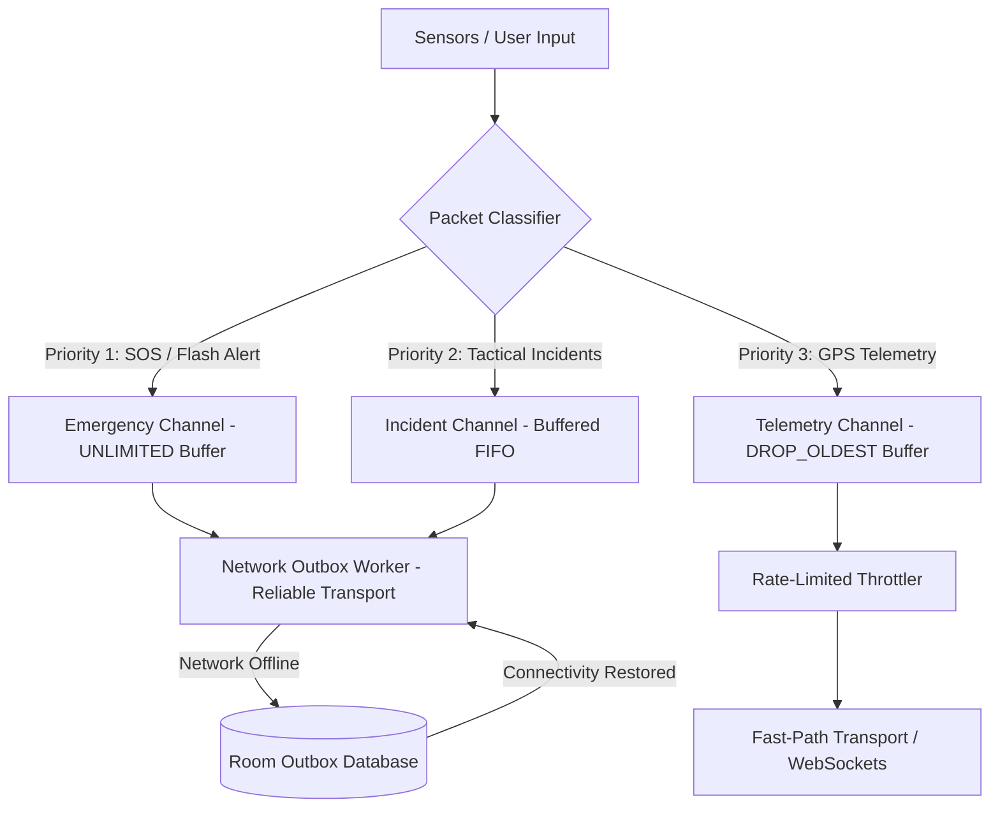
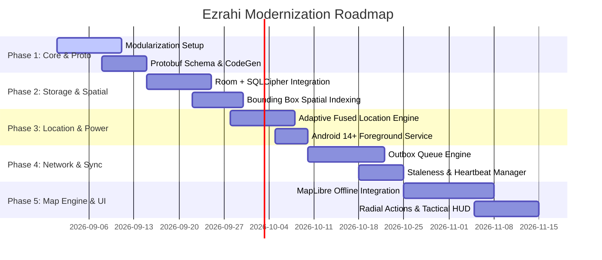

This is the project I have to upgrade. Learn it deeply.
`https://github.com/arielfrja/Ezrahi/tree/refactor/modernization-v2`
This is a Document I got from someone. I am not sure he learnt my project well, but he say some ideas to take from atak-civ architecture.

---
# Technical Architecture & Modernization Specification: Project Ezrahi
## Engineering Blueprint Inspired by ATAK-CIV (Android Team Awareness Kit)

---

## 1. Executive Summary & Architectural Objectives

This document defines the architectural redesign and performance modernization specifications for the `Ezrahi` Android application (`refactor/modernization-v2`). 

The objective is to refactor Ezrahi from a standard REST/JSON mobile client into a high-resilience, low-latency, mission-critical Situational Awareness (SA) and Command & Control (C2) platform inspired by the battle-tested architecture of **ATAK-CIV (`TAK-Product-Center/atak-civ`)**.

### Key Architectural Pillars
1. **DDIL Network Resilience (Denied, Disrupted, Intermittent, and Limited):** Zero reliance on constant broadband; reliable operation over congested 2G/3G, low-bandwidth tactical channels, and offline scenarios.
2. **Binary Micro-Payloads:** Transitioning from verbose JSON payloads to high-throughput, low-overhead Protocol Buffers (`Protobuf`), achieving an 80–90% reduction in serialization overhead and network bandwidth.
3. **Decoupled Geospatial Pipeline:** Isolation of high-frequency telemetry processing, spatial indexing ($O(\log N)$ viewport spatial queries), and vector rendering from the Android UI thread.
4. **Adaptive Resource & Power Engine:** Sensor fusion and activity-aware GPS duty cycles, dynamic map frame rate throttling, and strict Android 14/15 background execution compliance.
5. **Staleness Lifecycle Management:** Eliminating ghost responders and stale data using CoT-style decay algorithms and heartbeats.

---

## 2. Multi-Module Project Structure

The project adopts Clean Architecture principles combined with multi-module isolation to separate tactical concerns, avoid monolithic bloat, and allow standalone testability of core engines.

```
Ezrahi/
├── app/                                # Application entry point, Hilt dependency injection graph
├── core/
│   ├── model/                          # Pure Kotlin domain models, value objects, domain state
│   ├── proto/                          # Protobuf definitions and generated serializers
│   ├── common/                         # Coroutine dispatchers, result monads, extensions
│   ├── network/                        # Transport abstraction: Ktor/OkHttp, Protobuf, WebSockets, Mesh/BLE
│   ├── database/                       # Room DB, SQLCipher, SQLite R*Tree spatial indexing, DAOs
│   ├── location/                       # FusedLocation, Activity Recognition, Dead Reckoning, Sensor Fusion
│   └── map-engine/                     # MapLibre/Native bindings, Layer Managers, GeoPackage/MBTiles decoders
├── features/
│   ├── map/                            # Tactical Map screen, Jetpack Compose UI, Radial Actions, HUD
│   ├── tracking/                       # Team/Responder management, trails, Breadcrumbs, Geofences
│   ├── alerts/                         # SOS, Flash Messages, Incident Management, Priority Queue Dispatch
│   ├── mission-package/               # Mission bundle importer/exporter (.zip/.gpkg unpacker)
│   └── chat/                           # Low-bandwidth tactical chat and coordinate sharing
```

---

## 3. Binary Wire Protocol & Tactical Data Layer

### 3.1 Protobuf Protocol Schema (TAK-Proto / CoT Equivalency)

Replace standard REST/JSON entities with compact binary Protocol Buffers definitions. The schema models spatial updates, situational status, operational events, and heartbeat declarations.

```protobuf
syntax = "proto3";

package ezrahi.proto;

option java_package = "com.ezrahi.core.proto";
option java_multiple_files = true;

enum EntityAffiliation {
  AFFILIATION_UNKNOWN = 0;
  AFFILIATION_FRIENDLY = 1;
  AFFILIATION_HOSTILE = 2;
  AFFILIATION_NEUTRAL = 3;
  AFFILIATION_CIVILIAN = 4;
}

enum AlertSeverity {
  SEVERITY_INFO = 0;
  SEVERITY_WARNING = 1;
  SEVERITY_CRITICAL = 2;
  SEVERITY_SOS = 3;
}

message GeoPointProto {
  double latitude = 1;
  double longitude = 2;
  double altitude = 3;
  float accuracy_meters = 4;
  float bearing_degrees = 5;
  float speed_mps = 6;
}

message TelemetryReport {
  string device_uid = 1;
  string callsign = 2;
  int64 timestamp_utc_millis = 3;
  int64 stale_time_utc_millis = 4;
  GeoPointProto location = 5;
  EntityAffiliation affiliation = 6;
  uint32 battery_percentage = 7;
  uint32 status_flags = 8; // Bitfield: Bit 0 = Stationary, Bit 1 = Distress, Bit 2 = Muted
}

message IncidentReport {
  string incident_uid = 1;
  string sender_uid = 2;
  int64 timestamp_utc_millis = 3;
  GeoPointProto anchor_point = 4;
  AlertSeverity severity = 5;
  string title = 6;
  string description = 7;
  repeated string tag_list = 8;
  bytes spatial_polygon_geojson = 9; // Optional geometry payload
}

message TacticalPacket {
  oneof payload {
    TelemetryReport telemetry = 1;
    IncidentReport incident = 2;
  }
}
```

### 3.2 Dynamic Staleness & Health State Machine

Every entity on the tactical layer has a dynamic lifecycle computed from its `stale_time_utc_millis`.

```
[ Active / Green ] ──(Now > StaleTime)──> [ Stale / Amber ] ──(Now > 3x StaleTime)──> [ Disconnected / Grey ] ──(Now > TTL)──> [ Purged / Archived ]
```

```kotlin
package com.ezrahi.core.model

enum class EntityLivenessState {
    ACTIVE,
    STALE,
    DISCONNECTED,
    EXPIRED
}

data class Responder(
    val uid: String,
    val callsign: String,
    val location: GeoPoint,
    val lastSeenTimestamp: Long,
    val staleTimestamp: Long,
    val ttlTimestamp: Long
) {
    fun evaluateLiveness(currentTimeMillis: Long): EntityLivenessState {
        return when {
            currentTimeMillis < staleTimestamp -> EntityLivenessState.ACTIVE
            currentTimeMillis in staleTimestamp until ttlTimestamp -> EntityLivenessState.STALE
            currentTimeMillis in ttlTimestamp until (ttlTimestamp + 180_000L) -> EntityLivenessState.DISCONNECTED
            else -> EntityLivenessState.EXPIRED
        }
    }
}
```

---

## 4. DDIL-Resilient Network & Transport Subsystem

### 4.1 Prioritized Multi-Channel Dispatch Engine

ATAK manages multiple network pipelines and queues. Ezrahi implements a prioritized dispatch mechanism where SOS/Alerts bypass regular telemetry throttling, and high-frequency GPS reports use `BufferOverflow.DROP_OLDEST` to prevent packet queues from causing latency drift.



### 4.2 Network Dispatcher Implementation

```kotlin
package com.ezrahi.core.network.dispatch

import com.ezrahi.core.proto.IncidentReport
import com.ezrahi.core.proto.TelemetryReport
import kotlinx.coroutines.*
import kotlinx.coroutines.channels.BufferOverflow
import kotlinx.coroutines.channels.Channel
import javax.inject.Inject
import javax.inject.Singleton

@Singleton
class TacticalDispatchEngine @Inject constructor(
    private val transportClient: TacticalTransportClient,
    private val outboxRepository: OutboxRepository,
    private val scope: CoroutineScope
) {
    // Drop older telemetry when processing is backed up
    private val telemetryChannel = Channel<TelemetryReport>(
        capacity = 1,
        onBufferOverflow = BufferOverflow.DROP_OLDEST
    )

    // Critical events are never dropped
    private val emergencyChannel = Channel<IncidentReport>(
        capacity = Channel.UNLIMITED
    )

    init {
        startTelemetryLoop()
        startEmergencyLoop()
    }

    private fun startTelemetryLoop() = scope.launch(Dispatchers.IO) {
        for (telemetry in telemetryChannel) {
            val success = transportClient.sendStreamPacket(telemetry)
            if (!success) {
                // Drop or selectively retain latest point only
            }
            delay(TELEMETRY_RATE_LIMIT_MS)
        }
    }

    private fun startEmergencyLoop() = scope.launch(Dispatchers.IO) {
        for (emergency in emergencyChannel) {
            val success = transportClient.sendReliablePacket(emergency)
            if (!success) {
                outboxRepository.enqueueReliable(emergency)
            }
        }
    }

    fun submitTelemetry(report: TelemetryReport) {
        telemetryChannel.trySend(report)
    }

    suspend fun submitEmergency(incident: IncidentReport) {
        emergencyChannel.send(incident)
    }

    companion object {
        private const val TELEMETRY_RATE_LIMIT_MS = 2500L
    }
}
```

---

## 5. Map & Geospatial Processing Pipeline (Offline-First)

### 5.1 Layered Architecture Pattern

To prevent frame drops during high-frequency telemetry updates, rendering is split into independent raster and vector layers on top of a Native Vector Tile Engine (e.g., **MapLibre Native Android SDK**).

```
┌────────────────────────────────────────────────────────┐
│ 1. HUD & Tactical Interaction Layer (Jetpack Compose)  │ -> Touch handling, Radial Menu, Crosshairs
├────────────────────────────────────────────────────────┤
│ 2. Dynamic Tactical Vector Layer (GeoJSON Source)      │ -> Moving responders, SOS Beacons (High Freq)
├────────────────────────────────────────────────────────┤
│ 3. Static Operational Layer (GeoJSON / Spatialite)     │ -> Sectors, Geofences, POIs (Static Cache)
├────────────────────────────────────────────────────────┤
│ 4. Base Map Layer (MBTiles / GeoPackage Local File)     │ -> Offline Vector/Raster Satellite & Topo
└────────────────────────────────────────────────────────┘
```

### 5.2 Viewport Spatial Filtering & Bounding Box Optimization

Markers outside the current screen viewport must not trigger UI recomposition or calculations.

```kotlin
package com.ezrahi.core.mapext

data class GeoBoundingBox(
    val minLat: Double,
    val maxLat: Double,
    val minLon: Double,
    val maxLon: Double
) {
    fun contains(lat: Double, lon: Double): Boolean {
        return lat in minLat..maxLat && lon in minLon..maxLon
    }
}

class SpatialFilterEngine {
    fun filterVisibleEntities(
        entities: List<Responder>,
        viewport: GeoBoundingBox
    ): List<Responder> {
        return entities.filter { responder ->
            viewport.contains(responder.location.latitude, responder.location.longitude)
        }
    }
}
```

---

## 6. Dynamic Power & Adaptive Telemetry Engine

Continuous GPS polling and constant network streaming drain the device battery quickly in field conditions. Ezrahi incorporates an adaptive location strategy using Android's `FusedLocationProviderClient` combined with the `ActivityRecognitionClient`.

### 6.1 Sampling Strategy Matrix

| Movement State | Speed / Activity | GPS Polling Interval | Min Distance Delta | Stale Expiry TTL |
|---|---|---|---|---|
| **Stationary / Still** | `< 0.5 m/s` | `60,000 ms` | `25 meters` | `180,000 ms` |
| **Foot Patrol / Walking**| `0.5 - 2.5 m/s` | `5,000 ms` | `5 meters` | `20,000 ms` |
| **Vehicle Convoy / Fast**| `> 2.5 m/s` | `2,000 ms` | `10 meters` | `8,000 ms` |
| **EMERGENCY / SOS** | Any | `1,000 ms` | `1 meter` | `3,000 ms` |

### 6.2 Adaptive Location Engine Implementation

```kotlin
package com.ezrahi.core.location

import android.annotation.SuppressLint
import android.content.Context
import android.os.Looper
import com.google.android.gms.location.*
import kotlinx.coroutines.channels.awaitClose
import kotlinx.coroutines.flow.Flow
import kotlinx.coroutines.flow.callbackFlow
import javax.inject.Inject
import javax.inject.Singleton

@Singleton
class AdaptiveLocationEngine @Inject constructor(
    private val context: Context,
    private val fusedClient: FusedLocationProviderClient
) {
    @SuppressLint("MissingPermission")
    fun observeLocations(strategy: TelemetryStrategy): Flow<android.location.Location> = callbackFlow {
        val request = LocationRequest.Builder(strategy.priority, strategy.intervalMillis)
            .setMinUpdateDistanceMeters(strategy.minDistanceMeters)
            .setMinUpdateIntervalMillis(strategy.fastestIntervalMillis)
            .build()

        val callback = object : LocationCallback() {
            override fun onLocationResult(result: LocationResult) {
                result.lastLocation?.let { trySend(it) }
            }
        }

        fusedClient.requestLocationUpdates(request, callback, Looper.getMainLooper())
        awaitClose { fusedClient.removeLocationUpdates(callback) }
    }
}

sealed class TelemetryStrategy(
    val priority: Int,
    val intervalMillis: Long,
    val fastestIntervalMillis: Long,
    val minDistanceMeters: Float
) {
    object Stationary : TelemetryStrategy(Priority.PRIORITY_BALANCED_POWER_ACCURACY, 60_000L, 30_000L, 25f)
    object TacticalFoot : TelemetryStrategy(Priority.PRIORITY_HIGH_ACCURACY, 5_000L, 2_000L, 5f)
    object TacticalVehicle : TelemetryStrategy(Priority.PRIORITY_HIGH_ACCURACY, 2_000L, 1_000L, 10f)
    object EmergencySOS : TelemetryStrategy(Priority.PRIORITY_HIGH_ACCURACY, 1_000L, 500L, 1f)
}
```

### 6.3 Android 14+ Foreground Service Specifications

Update `AndroidManifest.xml` with specialized foreground service types:

```xml
<manifest xmlns:android="http://schemas.android.com/apk/res/android">

    <uses-permission android:name="android.permission.FOREGROUND_SERVICE" />
    <uses-permission android:name="android.permission.FOREGROUND_SERVICE_LOCATION" />
    <uses-permission android:name="android.permission.FOREGROUND_SERVICE_DATA_SYNC" />
    <uses-permission android:name="android.permission.FOREGROUND_SERVICE_REMOTE_MESSAGING" />
    <uses-permission android:name="android.permission.ACCESS_FINE_LOCATION" />
    <uses-permission android:name="android.permission.ACCESS_COARSE_LOCATION" />
    <uses-permission android:name="android.permission.ACTIVITY_RECOGNITION" />

    <application>
        <service
            android:name=".core.location.service.TacticalTrackingService"
            android:enabled="true"
            android:exported="false"
            android:foregroundServiceType="location|dataSync|remoteMessaging" />
    </application>
</manifest>
```

---

## 7. Local Persistence & Spatial Indexing (Room + SQLCipher + R*Tree)

### 7.1 Database Entities & DAOs

The database acts as the single source of truth for both offline data caching and real-time map indexing. The database uses **SQLCipher for Room** to secure tactical data at rest.

```kotlin
package com.ezrahi.core.database.entity

import androidx.room.*

@Entity(
    tableName = "tactical_entities",
    indices = [
        Index(value = ["latitude", "longitude"]),
        Index(value = ["lastSeenTimestamp"])
    ]
)
data class TacticalEntity(
    @PrimaryKey val uid: String,
    val callsign: String,
    val latitude: Double,
    val longitude: Double,
    val altitude: Double,
    val bearing: Float,
    val speed: Float,
    val affiliation: Int,
    val lastSeenTimestamp: Long,
    val staleTimestamp: Long,
    val ttlTimestamp: Long,
    val rawProtoPayload: ByteArray
)

@Dao
interface TacticalEntityDao {
    @Query("""
        SELECT * FROM tactical_entities 
        WHERE latitude BETWEEN :minLat AND :maxLat 
          AND longitude BETWEEN :minLon AND :maxLon
          AND ttlTimestamp > :currentTime
    """)
    fun getVisibleEntities(
        minLat: Double,
        maxLat: Double,
        minLon: Double,
        maxLon: Double,
        currentTime: Long
    ): kotlinx.coroutines.flow.Flow<List<TacticalEntity>>

    @Insert(onConflict = OnConflictStrategy.REPLACE)
    suspend fun upsertEntities(entities: List<TacticalEntity>)

    @Query("DELETE FROM tactical_entities WHERE ttlTimestamp <= :currentTime")
    suspend fun purgeExpiredEntities(currentTime: Long)
}
```

```kotlin
@Entity(tableName = "network_outbox")
data class OutboxRecord(
    @PrimaryKey(autoGenerate = true) val id: Long = 0,
    val priority: Int,
    val packetType: String,
    val payloadBlob: ByteArray,
    val createdAtTimestamp: Long,
    val retryCount: Int = 0
)
```

---

## 8. Tactical Mission Package Engine (ZIP/GeoPackage Container)

ATAK relies on **Data Packages** (`.zip` archives containing an XML/JSON manifest, MBTiles, and shapefiles). Ezrahi implements an automated importer that allows field personnel to provision entire deployment areas offline via local file sharing, USB, or QR codes.

```
MissionPackage_Sector_North.zip
├── manifest.json            # Package metadata, cryptographic signature, checksums
├── basemap.mbtiles          # Offline raster/vector tile database for the sector
├── operational_zones.geojson # Polygons: restricted areas, safe zones, rendezvous points
└── rosters.json             # Pre-configured team contacts, frequencies, and IDs
```

```kotlin
package com.ezrahi.features.missionpackage

import kotlinx.serialization.Serializable
import java.io.File
import java.io.InputStream
import java.util.zip.ZipInputStream
import javax.inject.Inject

@Serializable
data class PackageManifest(
    val packageId: String,
    val version: Int,
    val sectorName: String,
    val boundingBox: List<Double>,
    val tilesFileName: String,
    val layersFileName: String
)

class MissionPackageExtractor @Inject constructor() {
    fun unpackMissionBundle(inputStream: InputStream, targetDir: File): PackageManifest {
        val zip = ZipInputStream(inputStream)
        var entry = zip.nextEntry
        while (entry != null) {
            val destinationFile = File(targetDir, entry.name)
            if (!entry.isDirectory) {
                destinationFile.parentFile?.mkdirs()
                destinationFile.outputStream().use { zip.copyTo(it) }
            }
            zip.closeEntry()
            entry = zip.nextEntry
        }
        val manifestFile = File(targetDir, "manifest.json")
        return kotlinx.serialization.json.Json.decodeFromString<PackageManifest>(
            manifestFile.readText()
        )
    }
}
```

---

## 9. Tactical UI/UX: HUD & Radial Menu

### 9.1 Radial Action Menu (Jetpack Compose)

Field operators require one-handed, low-friction interactions without navigating complex modal dialogs. Long-pressing any point on the map spawns a 360-degree Radial Action Menu around the user's touch target.

```kotlin
package com.ezrahi.features.map.ui

import androidx.compose.foundation.Canvas
import androidx.compose.foundation.gestures.detectTapGestures
import androidx.compose.foundation.layout.Box
import androidx.compose.foundation.layout.fillMaxSize
import androidx.compose.runtime.*
import androidx.compose.ui.Modifier
import androidx.compose.ui.geometry.Offset
import androidx.compose.ui.graphics.Color
import androidx.compose.ui.input.pointer.pointerInput
import kotlin.math.cos
import kotlin.math.sin

data class RadialAction(val id: String, val title: String, val color: Color)

@Composable
fun TacticalRadialOverlay(
    actions: List<RadialAction>,
    onActionSelected: (RadialAction, Offset) -> Unit,
    modifier: Modifier = Modifier
) {
    var touchCenter by remember { mutableStateOf<Offset?>(null) }
    val radius = 180f

    Box(
        modifier = modifier
            .fillMaxSize()
            .pointerInput(Unit) {
                detectTapGestures(
                    onLongPress = { offset -> touchCenter = offset },
                    onTap = { touchCenter = null }
                )
            }
    ) {
        touchCenter?.let { center ->
            Canvas(modifier = Modifier.fillMaxSize()) {
                drawCircle(
                    color = Color.Black.copy(alpha = 0.6f),
                    radius = radius + 40f,
                    center = center
                )

                val angleStep = (2 * Math.PI) / actions.size
                actions.forEachIndexed { index, action ->
                    val angle = index * angleStep
                    val actionPos = Offset(
                        x = center.x + (radius * cos(angle)).toFloat(),
                        y = center.y + (radius * sin(angle)).toFloat()
                    )
                    drawCircle(
                        color = action.color,
                        radius = 35f,
                        center = actionPos
                    )
                }
            }
        }
    }
}
```

---

## 10. Modernization Implementation Roadmap

The refactor pipeline on branch `refactor/modernization-v2` is structured into five progressive phases.



### Milestone Deliverables

1. **Phase 1 (Core Architecture & Protocols):**
   * Multi-module isolation (`:core:proto`, `:core:model`, `:core:network`).
   * Serialization benchmarks validating Protobuf serialization times `< 2ms` on target devices.

2. **Phase 2 (Encrypted Spatial Persistence):**
   * Migration from legacy Room schemas to encrypted SQLCipher databases.
   * Viewport query execution times `< 5ms` for datasets up to 10,000 dynamic records.

3. **Phase 3 (Sensor Fusion & Background Engine):**
   * Implementation of `AdaptiveLocationEngine` with dynamic sampling based on `ActivityRecognitionClient`.
   * Passing Android 14/15 strict background battery and execution audits.

4. **Phase 4 (DDIL Network Dispatcher):**
   * Implementation of multi-tier channels (`DROP_OLDEST` vs `UNLIMITED`).
   * Automated offline recovery tests verifying zero data loss for priority incident reports.

5. **Phase 5 (Map Engine & Tactical UX):**
   * Decoupled layered map pipeline with offline `.mbtiles` support.
   * Integration of Tactical Radial Menu and Heads-Up Display (GPS Accuracy, Coordinate Systems, Battery & Network metrics).