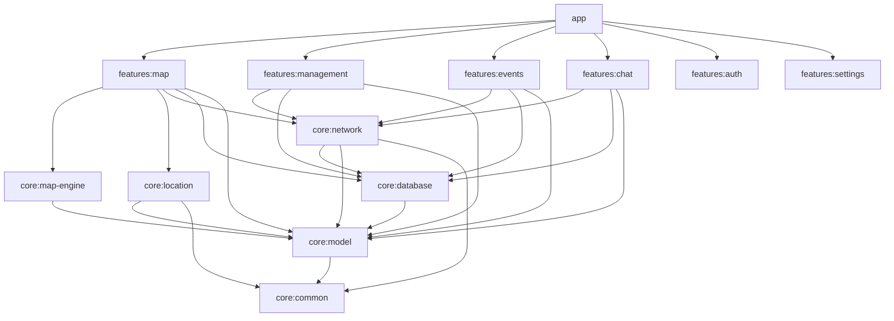
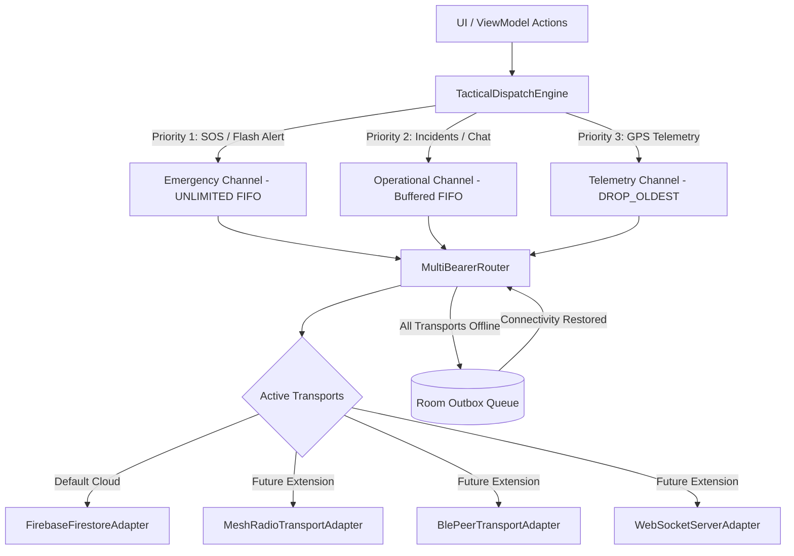

# Ezrahi Modernization: Architectural Blueprint & Phased Execution Plan

**Document Version:** 2.0.0  
**Target Platform:** Android 14/15 (API 34+, Min SDK 26)  
**Architecture Style:** Clean Multi-Module Architecture + Pluggable Multi-Bearer Network Engine  
**Inspired by:** ATAK-CIV (`TAK-Product-Center/atak-civ`) principles tailored for civilian search & rescue, group hiking, and field operations.

---

## 1. Architectural Vision & Core Principles

Project **Ezrahi** is transforming into a high-resilience, offline-first Field Situational Awareness (SA) and Command & Control (C2) platform.

### Core Architectural Decisions (Updated per Requirements)
1. **Modular-First Architecture:** Decompose the monolithic `:app` module into decoupled `:core:*` and `:features:*` modules to eliminate architectural coupling, optimize build times, and enable standalone testing.
2. **Pluggable Multi-Bearer Transport Layer:** Abstract network connectivity behind an extensible `TacticalTransportAdapter` interface. This ensures current Firebase Firestore transport works seamlessly alongside future alternative transports (e.g., **Meshtastic / LoRa Mesh**, **Bluetooth Low Energy (BLE)**, **Local WebSockets / TAK Server**, **Direct Wi-Fi Aware**).
3. **Configurable Staleness Decay & Manual Override:** Replace binary online flags with a 4-state lifecycle (`ACTIVE` ➔ `STALE` ➔ `DISCONNECTED` ➔ `FADED/EXPIRED`). Decay thresholds are fully configurable per event on the Event Management screen (defaults: **5 min ➔ 15 min ➔ 30 min ➔ Fade**), with manual state override capabilities for field managers.
4. **Modernized Map Engine:** Deprecate legacy `osmdroid` and migrate to **MapLibre Native Android SDK** (hardware-accelerated vector rendering, offline `.mbtiles` support, zero proprietary API keys, smooth high-density marker rendering).
5. **Adaptive GPS Power Engine:** Sensor-fusion and speed-aware duty cycling to extend field battery life from 3-4 hours to 14+ hours.
6. **Data Encryption Deferred:** Local database encryption (SQLCipher) is intentionally deferred to a future security hardening phase, keeping Room persistence lightweight and focused on performance and spatial querying.

---

## 2. Multi-Module Project Structure (Phase 1 Target)

```
Ezrahi/
├── app/                                  # Application entry point, Hilt aggregation, NavHost
│
├── core/
│   ├── model/                            # Pure Kotlin domain models, enums, value objects (no Android deps)
│   ├── common/                           # Coroutine dispatchers, Result monads, PiiSanitizer, ExceptionLogger
│   ├── database/                         # Room Database, DAOs, Entities, Spatial Bounding-Box queries
│   ├── network/                          # Pluggable Transport Abstraction, Outbox Queue, Firebase Adapter
│   ├── location/                         # Adaptive FusedLocation, Activity Recognition, Foreground Service
│   └── map-engine/                       # MapLibre Native wrapper, Tile Manager, MBTiles reader, Layer pipeline
│
└── features/
    ├── auth/                             # Login, Signup, Profile Setup (Jetpack Compose)
    ├── events/                           # Event Picker, Creation, Event Configuration (Staleness thresholds)
    ├── management/                       # Event Management, Role Assignment, Route Management, Participant states
    ├── map/                              # Tactical Map Screen, Radial Action Overlay, Tactical HUD Bar
    ├── chat/                             # Channel & Direct messaging, Emergency broadcast UI
    ├── direct/                           # Peer-to-peer direct communication list & thread
    └── settings/                         # App preferences, unit options (MGRS/ITM/LatLon), battery diagnostics
```

### Module Dependency Graph



---

## 3. Pluggable Multi-Bearer Transport Architecture

To support future alternative networking technologies (LoRa/Meshtastic mesh radios, direct BLE mesh, local Wi-Fi, WebSocket servers), the network subsystem is decoupled into a transport-agnostic pipeline.



### 3.1 Transport Abstraction Interface (`core:network`)

```kotlin
package com.arielfaridja.ezrahi.core.network.transport

import com.arielfaridja.ezrahi.core.model.FieldMessage
import com.arielfaridja.ezrahi.core.model.FieldReport
import com.arielfaridja.ezrahi.core.model.TelemetryUpdate
import kotlinx.coroutines.flow.Flow

enum class TransportBearer {
    CELLULAR_FIREBASE,
    LORA_MESH,
    BLUETOOTH_LE,
    LOCAL_WEBSOCKET
}

data class TransportCapabilities(
    val bearer: TransportBearer,
    val isAvailable: Boolean,
    val maxPayloadBytes: Int,
    val supportsStreaming: Boolean,
    val estimatedBandwidthKbps: Int
)

interface TacticalTransportAdapter {
    val bearer: TransportBearer
    val capabilities: Flow<TransportCapabilities>
    
    suspend fun sendTelemetry(eventId: String, telemetry: TelemetryUpdate): Boolean
    suspend fun sendEmergency(eventId: String, message: FieldMessage): Boolean
    suspend fun sendReport(eventId: String, report: FieldReport): Boolean
    suspend fun sendMessage(eventId: String, message: FieldMessage): Boolean
    
    fun observeIncomingTelemetry(eventId: String): Flow<TelemetryUpdate>
    fun observeIncomingEmergency(eventId: String): Flow<FieldMessage>
    fun observeIncomingReports(eventId: String): Flow<FieldReport>
    fun observeIncomingMessages(eventId: String): Flow<FieldMessage>
}
```

### 3.2 Prioritized Outbox Queue (`core:database`)

When the device is completely disconnected, reliable packets (SOS, Reports, Messages) are written to local Room persistence. Telemetry uses `DROP_OLDEST` to prevent queue bloat.

```kotlin
@Entity(tableName = "network_outbox")
data class OutboxRecord(
    @PrimaryKey(autoGenerate = true) val id: Long = 0,
    val eventId: String,
    val priority: Int, // 1 = SOS, 2 = Report, 3 = Message
    val payloadType: String,
    val payloadJson: String,
    val createdAtTimestamp: Long = System.currentTimeMillis(),
    val retryCount: Int = 0
)
```

---

## 4. Configurable Staleness Decay & Manual State Engine

Field teams operate in complex terrain where radio silence or terrain masking causes temporary disconnects. Ezrahi models entity health with a 4-state lifecycle configured per event.

### 4.1 State Transition Lifecycle

```
[ ACTIVE / Green ] ──(Age > StaleThreshold)──> [ STALE / Amber ] ──(Age > DisconnectThreshold)──> [ DISCONNECTED / Grey ] ──(Age > ExpireThreshold)──> [ FADED / Hidden ]
```

* **Active (Green):** Normal tracking, receiving heartbeats within threshold.
* **Stale (Amber):** Heartbeat delayed (e.g. temporary bad signal / screen off).
* **Disconnected (Grey):** Responder presumed out of coverage.
* **Faded / Hidden:** Entity hidden from active map view to prevent ghost markers (retained in participant list).

### 4.2 Event Configuration Model (`core:model`)

```kotlin
data class StalenessConfig(
    val staleThresholdMinutes: Int = 5,        // Default: 5 min -> Stale (Amber)
    val disconnectedThresholdMinutes: Int = 15, // Default: 15 min -> Disconnected (Grey)
    val expiredThresholdMinutes: Int = 30       // Default: 30 min -> Faded / Hidden
)

data class FieldEvent(
    val id: String = "",
    val name: String = "",
    val managerId: String = "",
    val stalenessConfig: StalenessConfig = StalenessConfig(),
    val isLive: Boolean = true,
    // ...
)
```

### 4.3 Participant State Model with Manual Override

```kotlin
enum class EntityLivenessState {
    ACTIVE,
    STALE,
    DISCONNECTED,
    EXPIRED;

    companion object {
        fun compute(
            lastSeenTimestamp: Long,
            config: StalenessConfig,
            now: Long = System.currentTimeMillis()
        ): EntityLivenessState {
            val ageMinutes = (now - lastSeenTimestamp) / (60 * 1000L)
            return when {
                ageMinutes < config.staleThresholdMinutes -> ACTIVE
                ageMinutes < config.disconnectedThresholdMinutes -> STALE
                ageMinutes < config.expiredThresholdMinutes -> DISCONNECTED
                else -> EXPIRED
            }
        }
    }
}

data class EventParticipant(
    val userId: String = "",
    val fullName: String = "",
    val role: UserRole = UserRole.MEMBER,
    val currentLocation: GeoPoint? = null,
    val lastSeenTimestamp: Long = System.currentTimeMillis(),
    val manualStateOverride: EntityLivenessState? = null // Manager manual override
) {
    fun effectiveState(config: StalenessConfig, now: Long = System.currentTimeMillis()): EntityLivenessState {
        return manualStateOverride ?: EntityLivenessState.compute(lastSeenTimestamp, config, now)
    }
}
```

### 4.4 Event Page UI Capabilities
* **Management Settings:** Sliders / Number Pickers to adjust `Stale`, `Disconnected`, and `Expired` duration thresholds.
* **Participant Roster Overrides:** Quick action on any participant item to manually set state (e.g., "Mark as Active via Radio Confirmation", "Force Disconnected", "Clear Override").

---

## 5. Map Engine Modernization (MapLibre Native Android)

### Why Deprecate `osmdroid`?
* `osmdroid` uses legacy Canvas 2D CPU rendering, resulting in frame drops with complex GPX tracks and 50+ markers.
* Limited styling, poor support for modern vector tiles, and no hardware-accelerated WebGL/OpenGL rendering.

### Target Solution: MapLibre Native Android SDK (`core:map-engine`)
* **Vector Hardware Acceleration:** OpenGL/Vulkan rendering for 60 FPS pan/zoom.
* **Offline First (`.mbtiles`):** Native support for offline vector & raster tile packages loaded directly from device storage.
* **Layered Vector Architecture:**
  1. Base Map Layer (Local MBTiles or OpenMapTiles vector source).
  2. Route Layer (Hardware-accelerated GeoJSON Polyline).
  3. Dynamic Tactical Layer (GeoJSON Source for moving participants with staleness color tinting).
  4. Incident / Report Layer (Clustered or styled symbol layer).
  5. HUD & Radial Action Layer (Jetpack Compose overlay).

---

## 6. Adaptive GPS & Power Management

### Sampling Strategy Matrix

| Movement State | Speed / Activity | GPS Polling Interval | Min Distance Delta |
| :--- | :--- | :--- | :--- |
| **Stationary / Still** | `< 0.5 m/s` | `60,000 ms` (1 min) | `25 meters` |
| **Foot Patrol / Walking** | `0.5 - 2.5 m/s` | `5,000 ms` (5 sec) | `5 meters` |
| **Vehicle Convoy / Fast** | `> 2.5 m/s` | `2,000 ms` (2 sec) | `10 meters` |
| **EMERGENCY / SOS** | Any | `1,000 ms` (1 sec) | `1 meter` |

### Android 14+ Foreground Service Integration
* `LocationTrackingService` runs with `android:foregroundServiceType="location|dataSync"`.
* Employs `ActivityRecognitionClient` to automatically switch between `Stationary` and `FootPatrol` profiles, slashing battery drain.

---

## 7. Phased Execution Roadmap

```mermaid
gantt
    title Ezrahi Modernization Roadmap
    dateFormat  YYYY-MM-DD
    section Phase 1: Modularization
    Create :core:* modules            :active, p1_1, 2026-09-01, 7d
    Extract :core:model & common       :p1_2, after p1_1, 5d
    Extract :core:database & network   :p1_3, after p1_2, 7d
    Verify build & tests               :p1_4, after p1_3, 3d
    section Phase 2: Pluggable Network
    Transport Interfaces & Outbox      :p2_1, after p1_4, 6d
    Firebase Adapter & Outbox Worker   :p2_2, after p2_1, 6d
    Multi-Bearer Routing Layer         :p2_3, after p2_2, 4d
    section Phase 3: Staleness Engine
    StalenessConfig in Event Model     :p3_1, after p2_3, 4d
    Event Page Settings & UI Sliders   :p3_2, after p3_1, 5d
    Manual State Override & Map Tinting:p3_3, after p3_2, 5d
    section Phase 4: MapLibre Engine
    MapLibre Native Integration        :p4_1, after p3_3, 8d
    Offline MBTiles Loader             :p4_2, after p4_1, 6d
    Layered Vector Pipeline            :p4_3, after p4_2, 6d
    section Phase 5: Adaptive Location
    AdaptiveLocationEngine             :p5_1, after p4_3, 6d
    Activity Recognition Fusion        :p5_2, after p5_1, 5d
    section Phase 6: Tactical UI
    Compose Radial Action Menu         :p6_1, after p5_2, 6d
    Tactical HUD Overlay Bar           :p6_2, after p6_1, 5d
```

---

### Detailed Breakdown by Phase

### Phase 1: Clean Multi-Module Decomposition
**Goal:** Restructure the project from single `:app` monolith into clean, isolated modules.

* **Tasks:**
  1. Configure `settings.gradle.kts` and Version Catalog (`gradle/libs.versions.toml`) with module definitions.
  2. Create `:core:model`: Move domain models (`FieldModels.kt`), enums, and pure business objects.
  3. Create `:core:common`: Move logging (`ExceptionLogger`, `GlobalCrashHandler`, `PiiSanitizer`), dispatchers, and result wrappers.
  4. Create `:core:database`: Move Room database (`EzrahiDatabase.kt`), entities (`LocalEntities.kt`), and DAOs (`EzrahiDao.kt`).
  5. Create `:core:network`: Move repository interfaces and Firebase network data sources.
  6. Create `:core:location`: Move location helpers and base location contracts.
  7. Refactor `:app` to bind Hilt dependency injection across the newly created modules.
* **Verification Deliverable:** Successful clean build of all modules via `sh gradlew assembleDebug`.

---

### Phase 2: Pluggable Multi-Bearer Transport & Priority Outbox Engine
**Goal:** Abstract network transport so alternative technologies (Mesh/BLE/WebSockets) can be plugged in without changing business logic, and guarantee zero packet loss when offline.

* **Tasks:**
  1. Define `TacticalTransportAdapter` interface and `TransportCapabilities` in `:core:network`.
  2. Implement `FirebaseTransportAdapter` as the primary cloud transport.
  3. Create `OutboxRecord` Room entity and `OutboxDao` in `:core:database`.
  4. Implement `TacticalDispatchEngine`:
     * High-frequency GPS: `Channel<TelemetryUpdate>(capacity = 1, onBufferOverflow = BufferOverflow.DROP_OLDEST)`
     * Reliable incidents / messages / SOS: `Channel<FieldMessage>(capacity = Channel.UNLIMITED)`
  5. Build `OutboxSyncWorker` using `WorkManager` with `NetworkType.CONNECTED` to flush queued records upon network restoration.
  6. Provide mock/skeleton `MeshTransportAdapter` adhering to `MeshTransceiver` to validate multi-bearer extensibility.
* **Verification Deliverable:** Unit tests verifying `DROP_OLDEST` behavior for telemetry and persistent outbox queue draining for SOS.

---

### Phase 3: Configurable Staleness Decay & Manual State Management
**Goal:** Implement dynamic entity health decay with event-level configuration and manual manager controls.

* **Tasks:**
  1. Add `StalenessConfig` (default: 5m stale / 15m disconnect / 30m expire) to `FieldEvent` model and Firestore mapping.
  2. Update Event Management screen (`EventManagementScreen.kt` & `EventManagementViewModel.kt`) with settings controls to adjust staleness thresholds.
  3. Add `manualStateOverride: EntityLivenessState?` to `EventParticipant`.
  4. Add manual state override dialog and quick-action menu to Participant list in Event Management.
  5. Implement `EntityLivenessState` computation in `MapViewModel` with reactive color tinting:
     * **Green:** Active
     * **Amber:** Stale
     * **Grey:** Disconnected
     * **Hidden:** Faded/Expired
* **Verification Deliverable:** Unit tests validating threshold transitions and manual override precedence; UI testing on Event Management screen.

---

### Phase 4: Modern Map Engine Migration (MapLibre Native Android)
**Goal:** Replace deprecated `osmdroid` with hardware-accelerated MapLibre Native supporting offline `.mbtiles`.

* **Tasks:**
  1. Add `org.maplibre.gl:android-sdk` to Version Catalog and `:core:map-engine`.
  2. Build Compose wrapper for MapLibre `MapView`.
  3. Implement `OfflineTileManager` to discover and load local `.mbtiles` packages from external storage.
  4. Create GeoJSON Vector Layers:
     * GPX active trail line layer with customizable style.
     * Dynamic participant symbol layer with dynamic icon rotation (bearing) and color tint (staleness).
     * Incident report symbol & callout layer.
  5. Implement Viewport Bounding Box spatial filtering to optimize on-screen marker updates.
* **Verification Deliverable:** MapScreen rendering 60 FPS vector tiles and offline `.mbtiles` loading without internet connectivity.

---

### Phase 5: Adaptive Location Power Engine & Android 14/15 Compliance
**Goal:** Minimize battery drain during 8-12 hour hikes using activity-aware location sampling.

* **Tasks:**
  1. Create `AdaptiveLocationEngine` in `:core:location` supporting `Stationary` (60s), `FootPatrol` (5s), `Vehicle` (2s), and `EmergencySOS` (1s) strategies.
  2. Integrate Google `ActivityRecognitionClient` transitions (STILL, WALKING, IN_VEHICLE).
  3. Modernize `LocationTrackingService` with Android 14+ `ServiceInfo.FOREGROUND_SERVICE_TYPE_LOCATION | FOREGROUND_SERVICE_TYPE_DATA_SYNC`.
  4. Add low-power fallback when battery level drops below 15%.
* **Verification Deliverable:** Battery profiling demonstrating > 60% power savings in stationary/hiking scenarios.

---

### Phase 6: Tactical UI / UX (Radial Action Menu & Heads-Up Display)
**Goal:** Enable low-friction, single-handed field operation and situational awareness.

* **Tasks:**
  1. Build `TacticalRadialOverlay` in Compose: Long-pressing anywhere on the map opens a 360° circular quick-action menu (SOS, Drop Report, Measure, Ping Participant).
  2. Build `TacticalHudBar` top status overlay:
     * Current Coordinate (MGRS / Israel Transverse Mercator ITM / WGS84).
     * GPS Fix Accuracy (meters) & Altitude.
     * Active Network Bearer & Pending Outbox packet count.
     * Battery Level & Current GPS Strategy.
* **Verification Deliverable:** Field usability verification with one-handed touch interactions.

---

## 8. Phase Execution Protocol & Working Agreements

These conventions govern how each phase is executed, verified, and handed off. They are mandatory for every phase in this roadmap.

### 8.1 Phase Lifecycle
1. **Execute Phase:** Implement all tasks and deliverables defined for the phase.
2. **Test the Application:** After the phase's implementation is complete, verify the app still builds and runs correctly (`sh gradlew assembleDebug`), and confirm that new development works as expected:
   * Build success (compile, KSP/Hilt/Room codegen, packaging).
   * Runtime smoke check on the target device (critical screens still navigate and render).
   * Any phase-specific unit/instrumented tests pass.
   * Existing exception-logging integration (fix-6) continues to work and logs to `app_errors`.
3. **Report to PO (Project Owner):** Summarize what was implemented, what was verified, test results, and any risks or follow-ups.
4. **Wait for Confirmation:** Do **NOT** begin the next phase until the PO explicitly confirms. The roadmap is strictly sequential; each phase is gated on PO approval.

### 8.2 Model / Tool Efficiency Rules
* **Minimize model requests:** Prefer long, comprehensive messages and batch as many independent tool calls as possible into a single assistant turn (parallel reads, parallel file writes, parallel verification commands).
* **Batch read-first:** Before editing, read all relevant files in parallel in one turn.
* **Batch writes:** Write or edit multiple independent files in one turn where the content is already known.
* **Batch verification:** Run build/tests/grep checks together rather than one command per turn.
* Avoid ping-ponging small questions back and forth; consolidate decisions and only ask when truly blocking.

### 8.3 Codebase Rules Carried Forward
* Every `catch` / `runCatching.onFailure` routes through `ExceptionLogger` (fix-6). Never swallow errors silently.
* Never log secrets or PII beyond a user id; `PiiSanitizer` stays in the write path.
* No comments in code unless asked; follow existing naming and structure conventions.
* Preserve Firestore document schemas (human-readable JSON) — Protobuf is only introduced for offline/mesh payloads when that phase arrives.
* Keep `app/google-services.json` and `local.properties` untracked (gitignored).

### 8.4 Definition of "Done" for a Phase
- [ ] All tasks in the phase checklist implemented.
- [ ] `sh gradlew assembleDebug` succeeds (clean of the touched modules).
- [ ] App smoke test on device passes (critical flows render).
- [ ] No regressions in exception logging.
- [ ] Changes committed/pushed only after PO confirmation.
- [ ] Phase marked complete in `docs/summaries/refactor-fixes.md` progress tracker.

---

## 9. Summary of Major Architectural Decisions

| Area | Decision | Rationale |
| :--- | :--- | :--- |
| **Modularity** | Multi-module `:core:*` & `:features:*` | Eliminates monolithic spaghetti, speeds up builds, isolates domain logic. |
| **Data Encryption** | Deferred to future phase | Focuses current engineering effort on modularity, offline maps, and networking. |
| **Map Engine** | MapLibre Native Android SDK | Deprecates aged `osmdroid`; delivers 60fps vector rendering and native `.mbtiles`. |
| **Networking** | Pluggable `TacticalTransportAdapter` | Prepares architecture for LoRa mesh / BLE while keeping Firestore as default cloud bearer. |
| **Staleness** | Configurable per event (5m ➔ 15m ➔ 30m) + Manual Override | Fits real-world hiking dynamics; allows managers to manually confirm participant safety. |
| **Outbox** | Priority Room Queue (`DROP_OLDEST` for GPS, reliable for SOS) | Eliminates data loss during cellular dead zones in deserts/mountains. |
| **Power** | Adaptive FusedLocation + Activity Recognition | Prevents phone dead battery during long field excursions. |
